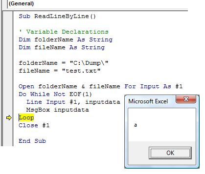

<div align="center">

## Read a text file line by line


</div>

### Description

Purpose is to open up a text file and read the contents line by line.
 
### More Info
 
To modify for your use do the following:

1. Replace "folderName" and "fileName" to suit for your requirement.

2. Please make sure that when you define "folderName", that the backslash is included (Ex. C:\Dump\"

3. The variable "inputdata" will hold the current value of the line of text being read.

Note:

This code will only open the text file and read its contents line by line.


<span>             |<span>
---                |---
**Submitted On**   |
**By**             |[c23lemon](https://github.com/Planet-Source-Code/PSCIndex/blob/master/ByAuthor/c23lemon.md)
**Level**          |Beginner
**User Rating**    |4.0 (8 globes from 2 users)
**Compatibility**  |VBA MS Excel
**Category**       |[Microsoft Office Apps/VBA](https://github.com/Planet-Source-Code/PSCIndex/blob/master/ByCategory/microsoft-office-apps-vba__1-42.md)
**World**          |[Visual Basic](https://github.com/Planet-Source-Code/PSCIndex/blob/master/ByWorld/visual-basic.md)
**Archive File**   |[](https://github.com/Planet-Source-Code/c23lemon-read-a-text-file-line-by-line__1-71320/archive/master.zip)


### Source Code

```
Sub ReadLineByLine()
' Variable Declarations
Dim folderName As String
Dim fileName As String
folderName = "C:\Dump\"
fileName = "test.txt"
Open folderName & fileName For Input As #1
Do While Not EOF(1)
 Line Input #1, inputdata
 MsgBox inputdata
Loop
Close #1
End Sub
```

